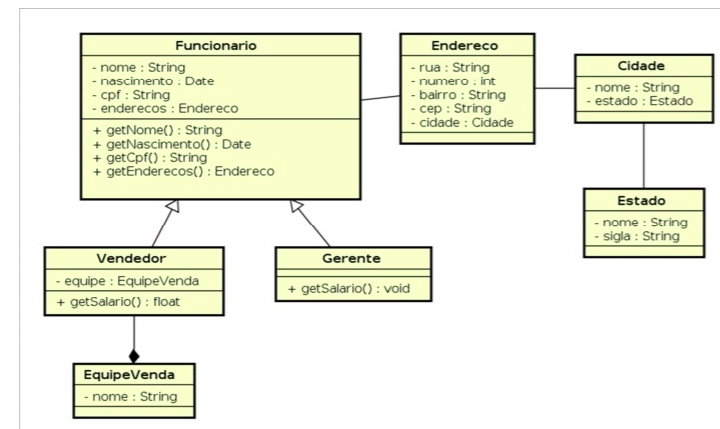

# Diagrama de Classes

### Relatório

O conceito de herança é utilizado nas classes Vendedor e Gerente que herdam de Funcionario.

O conceito de abstração é utilizado nas classes nos métodos que retornam características ou realizam ações em um objeto

O conceito de polimorfismo é observado principalmente com o atributo nome que tem uma significado que varia de acordo com a sua classe, não nenhum caso de métodos sobrescrito neste exemplo.

O conceito de encapsulamento é utilizado para acessar dados do objeto sem acessar diretamente a informação no objeto, utilizado getters e setters para acessar os dados.